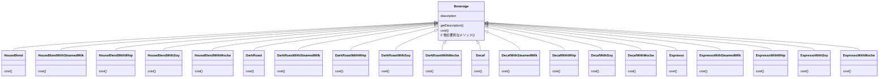

```mermaid
classDiagram
  class Beverage{
    description
    getDescription()
    cost()
    // 他の便利なメソッド()
  }

  class HouseBlend{
    cost()
  }

  class HouseBlendWithSteamedMilk{
    cost()
  }

  class HouseBlendWithWhip{
    cost()
  }

  class HouseBlendWithSoy{
    cost()
  }

  class HouseBlendWithMocha{
    cost()
  }

  class DarkRoast{
    cost()
  }

  class DarkRoastWithSteamedMilk{
    cost()
  }

  class DarkRoastWithWhip{
    cost()
  }

  class DarkRoastWithSoy{
    cost()
  }

  class DarkRoastWithMocha{
    cost()
  }

  class Decaf{
    cost()
  }

  class DecafWithSteamedMilk{
    cost()
  }

  class DecafWithWhip{
    cost()
  }

  class DecafWithSoy{
    cost()
  }

  class DecafWithMocha{
    cost()
  }

  class Espresso{
    cost()
  }

  class EspressoWithSteamedMilk{
    cost()
  }

  class EspressoWithWhip{
    cost()
  }

  class EspressoWithSoy{
    cost()
  }

  class EspressoWithMocha{
    cost()
  }

  Beverage <|-- HouseBlend
  Beverage <|-- HouseBlendWithSteamedMilk
  Beverage <|-- HouseBlendWithWhip
  Beverage <|-- HouseBlendWithSoy
  Beverage <|-- HouseBlendWithMocha
  Beverage <|-- DarkRoast
  Beverage <|-- DarkRoastWithSteamedMilk
  Beverage <|-- DarkRoastWithWhip
  Beverage <|-- DarkRoastWithSoy
  Beverage <|-- DarkRoastWithMocha
  Beverage <|-- Decaf
  Beverage <|-- DecafWithSteamedMilk
  Beverage <|-- DecafWithWhip
  Beverage <|-- DecafWithSoy
  Beverage <|-- DecafWithMocha
  Beverage <|-- Espresso
  Beverage <|-- EspressoWithSteamedMilk
  Beverage <|-- EspressoWithWhip
  Beverage <|-- EspressoWithSoy
  Beverage <|-- EspressoWithMocha

```
