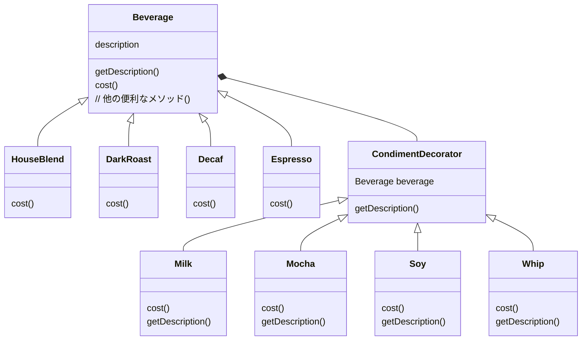

```mermaid
classDiagram
  class Beverage{
    description
    getDescription()
    cost()
    // 他の便利なメソッド()
  }

  class HouseBlend{
    cost()
  }

  class DarkRoast{
    cost()
  }

  class Decaf{
    cost()
  }

  class Espresso{
    cost()
  }

  class CondimentDecorator{
    Beverage beverage
    getDescription()
  }

  class Milk{
    cost()
    getDescription()
  }

  class Mocha{
    cost()
    getDescription()
  }

  class Soy{
    cost()
    getDescription()
  }

  class Whip{
    cost()
    getDescription()
  }

  Beverage <|-- HouseBlend
  Beverage <|-- DarkRoast
  Beverage <|-- Decaf
  Beverage <|-- Espresso
  Beverage *-- CondimentDecorator
  CondimentDecorator <|-- Milk
  CondimentDecorator <|-- Mocha
  CondimentDecorator <|-- Soy
  CondimentDecorator <|-- Whip

```
