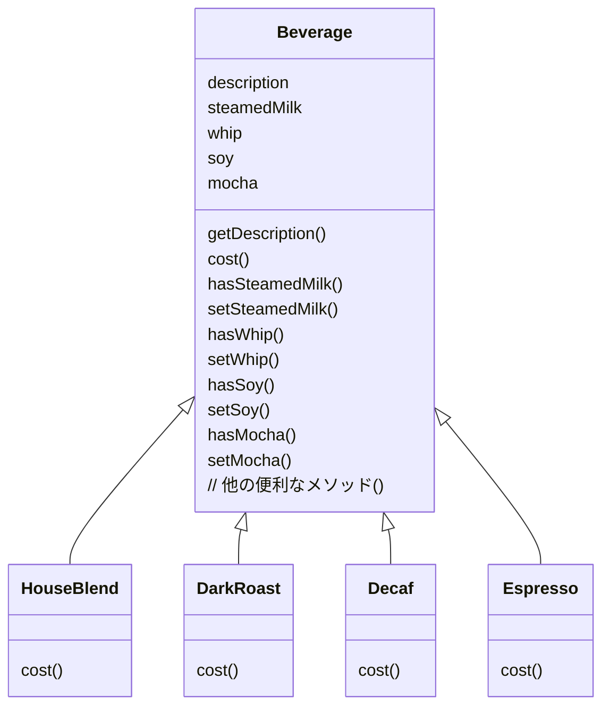

```mermaid
classDiagram
  class Beverage{
    description
    steamedMilk
    whip
    soy
    mocha
    getDescription()
    cost()
    
    hasSteamedMilk()
    setSteamedMilk()
    hasWhip()
    setWhip()
    hasSoy()
    setSoy()
    hasMocha()
    setMocha()
    // 他の便利なメソッド()
  }

  class HouseBlend{
    cost()
  }

  class DarkRoast{
    cost()
  }

  class Decaf{
    cost()
  }

  class Espresso{
    cost()
  }

  Beverage <|-- HouseBlend
  Beverage <|-- DarkRoast
  Beverage <|-- Decaf
  Beverage <|-- Espresso

```
