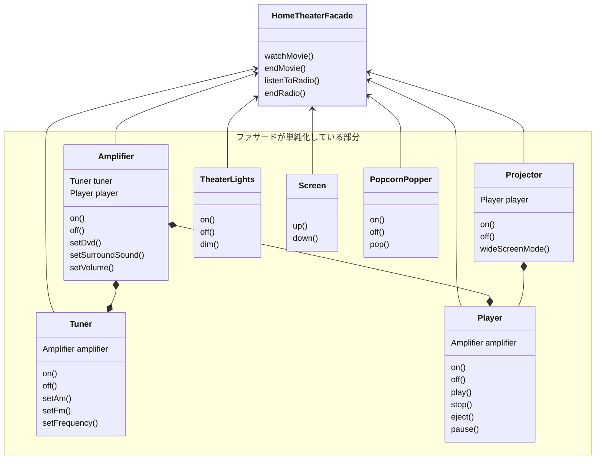

```mermaid
classDiagram
  class HomeTheaterFacade{
    watchMovie()
    endMovie()
    listenToRadio()
    endRadio()
  }

  namespace ファサードが単純化している部分{
    class Amplifier{
      Tuner tuner
      Player player
      on()
      off()
      setDvd()
      setSurroundSound()
      setVolume()
    }
    class Tuner{
      Amplifier amplifier
      on()
      off()
      setAm()
      setFm()
      setFrequency()
    }
    class Player{
      Amplifier amplifier
      on()
      off()
      play()
      stop()
      eject()
      pause()
    }

    class Projector{
      Player player
      on()
      off()
      wideScreenMode()
    }
    class TheaterLights{
      on()
      off()
      dim()
    }
    class Screen{
      up()
      down()
    }
    class PopcornPopper{
      on()
      off()
      pop()
    }
  }

  HomeTheaterFacade <-- Amplifier
  HomeTheaterFacade <-- Tuner
  HomeTheaterFacade <-- Player
  HomeTheaterFacade <-- Projector
  HomeTheaterFacade <-- TheaterLights
  HomeTheaterFacade <-- Screen
  HomeTheaterFacade <-- PopcornPopper

  Amplifier *--* Tuner
  Amplifier *--* Player
  Projector *-- Player


```
