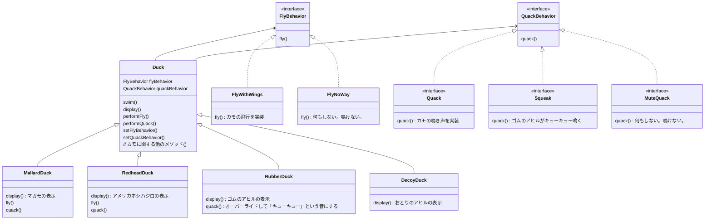

```mermaid
classDiagram
	class Duck{
    FlyBehavior flyBehavior
    QuackBehavior quackBehavior
		swim()
		display()
    performFly()
    performQuack()
    setFlyBehavior()
    setQuackBehavior()
		// カモに関する他のメソッド()
	}
  
  class FlyBehavior{
    <<interface>>
    fly()
  }

  class FlyWithWings{
    fly() カモの飛行を実装
  }

  class FlyNoWay{
    fly() 何もしない。鳴けない。
  }

  class QuackBehavior{
    <<interface>>
    quack()
  }

  class Quack{
    <<interface>>
    quack() カモの鳴き声を実装
  }

  class Squeak{
    <<interface>>
    quack() ゴムのアヒルがキューキュー鳴く
  }

  class MuteQuack{
    <<interface>>
    quack() 何もしない。鳴けない。
  }

	class MallardDuck{
		display() マガモの表示
    fly()
    quack()
	}

	class RedheadDuck{
		display() アメリカホシハジロの表示
    fly()
    quack()
	}

	class RubberDuck{
		display() ゴムのアヒルの表示
		quack() オーバーライドして「キューキュー」という音にする
	}

  class DecoyDuck{
    display() おとりのアヒルの表示
  }
	
	

	Duck <|-- MallardDuck
	Duck <|-- RedheadDuck
	Duck <|-- RubberDuck
  Duck <|-- DecoyDuck
  FlyBehavior <|.. FlyWithWings
  FlyBehavior <|.. FlyNoWay
  QuackBehavior <|.. Quack
  QuackBehavior <|.. Squeak
  QuackBehavior <|.. MuteQuack
  FlyBehavior <-- Duck
  QuackBehavior <-- Duck
  
```
