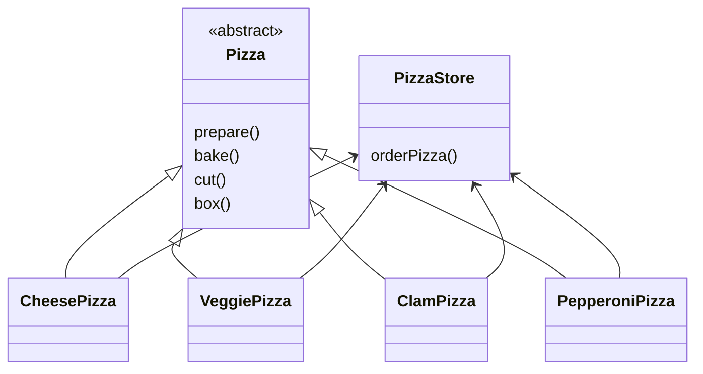

```mermaid
classDiagram
  class PizzaStore{
    orderPizza()
  }

  class Pizza{
    <<abstract>>
    prepare()
    bake()
    cut()
    box()
  }

  class CheesePizza{
  }

  class VeggiePizza{
  }

  class ClamPizza{
  }

  class PepperoniPizza{
  }

  Pizza <|-- CheesePizza
  Pizza <|-- VeggiePizza
  Pizza <|-- ClamPizza
  Pizza <|-- PepperoniPizza

  PizzaStore <-- CheesePizza
  PizzaStore <-- VeggiePizza
  PizzaStore <-- ClamPizza
  PizzaStore <-- PepperoniPizza
```
