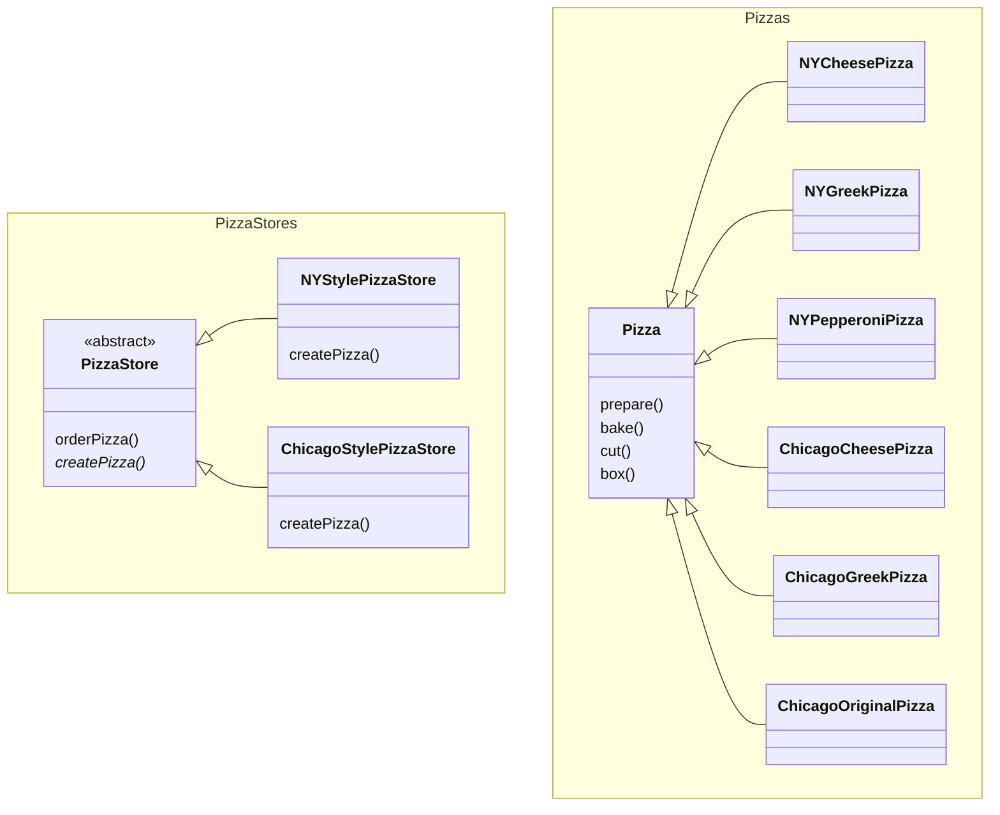

```mermaid
classDiagram
  namespace PizzaStores{
    class PizzaStore{
      <<abstract>>
      orderPizza()
      createPizza()*
    }

    class NYStylePizzaStore{
      createPizza()
    }

    class ChicagoStylePizzaStore{
      createPizza()
    }
  }

  namespace Pizzas{
    class Pizza{
      prepare()
      bake()
      cut()
      box()
    }

    class NYCheesePizza{

    }
    class NYGreekPizza{

    }
    class NYPepperoniPizza{

    }

    class ChicagoCheesePizza{

    }
    class ChicagoGreekPizza{

    }
    class ChicagoOriginalPizza{

    }
  }

  PizzaStore <|-- NYStylePizzaStore
  PizzaStore <|-- ChicagoStylePizzaStore

  Pizza <|-- NYCheesePizza
  Pizza <|-- NYGreekPizza
  Pizza <|-- NYPepperoniPizza
  Pizza <|-- ChicagoCheesePizza
  Pizza <|-- ChicagoGreekPizza
  Pizza <|-- ChicagoOriginalPizza
```
