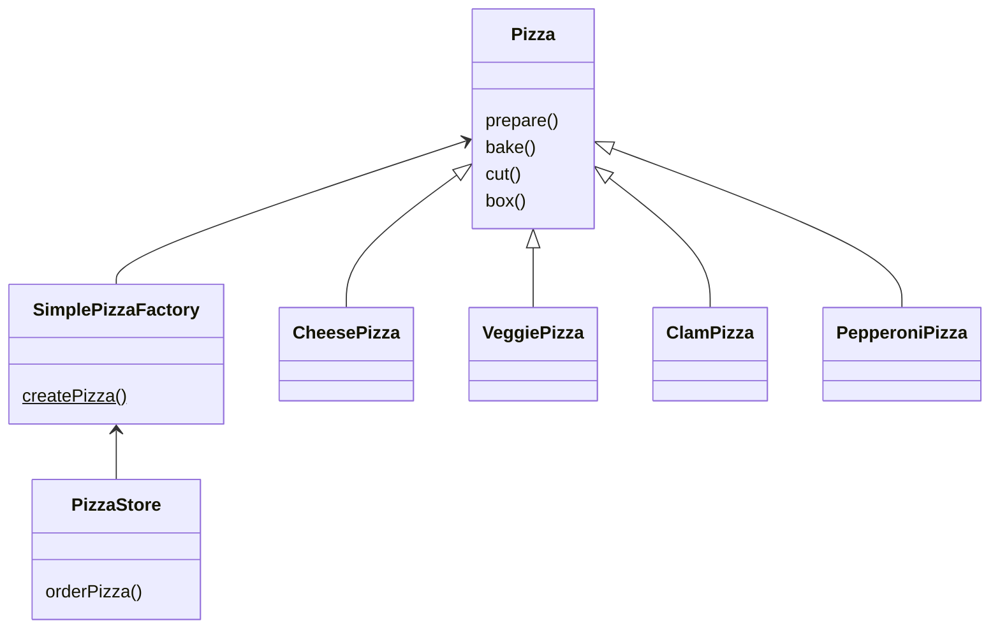

```mermaid
classDiagram
  class PizzaStore{
    orderPizza()
  }

  class SimplePizzaFactory{
    createPizza()$
  }

  class Pizza{
    prepare()
    bake()
    cut()
    box()
  }

  class CheesePizza{
  }

  class VeggiePizza{
  }

  class ClamPizza{
  }

  class PepperoniPizza{
  }

  SimplePizzaFactory <-- PizzaStore
  Pizza <-- SimplePizzaFactory
  Pizza <|-- CheesePizza
  Pizza <|-- VeggiePizza
  Pizza <|-- ClamPizza
  Pizza <|-- PepperoniPizza

```
