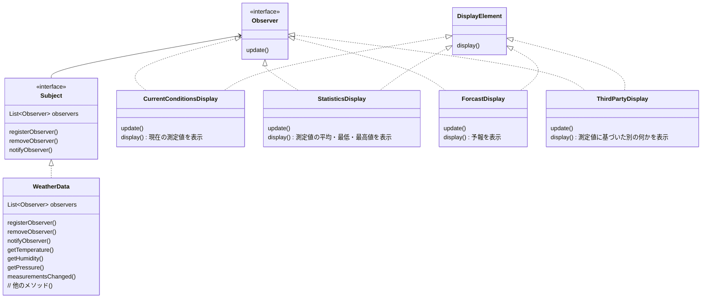

```mermaid
classDiagram
  class Subject{
    <<interface>>
    List~Observer~ observers
    registerObserver()
    removeObserver()
    notifyObserver()
  }

  class Observer{
    <<interface>>
    update()
  }

  class DisplayElement{
    display()
  }

  class WeatherData{
    List~Observer~ observers
    registerObserver()
    removeObserver()
    notifyObserver()
    getTemperature()
    getHumidity()
    getPressure()
    measurementsChanged()
    // 他のメソッド()
  }

  class CurrentConditionsDisplay{
    update()
    display() 現在の測定値を表示
  }

  class StatisticsDisplay{
    update()
    display() 測定値の平均・最低・最高値を表示
  }

  class ForcastDisplay{
    update()
    display() 予報を表示
  }

  class ThirdPartyDisplay{
    update()
    display() 測定値に基づいた別の何かを表示
  }
  
  Subject <|.. WeatherData
  Observer <-- Subject
  Observer <|.. CurrentConditionsDisplay
  Observer <|.. StatisticsDisplay
  Observer <|.. ForcastDisplay
  Observer <|.. ThirdPartyDisplay
  DisplayElement <|.. CurrentConditionsDisplay
  DisplayElement <|.. StatisticsDisplay
  DisplayElement <|.. ForcastDisplay
  DisplayElement <|.. ThirdPartyDisplay
```
